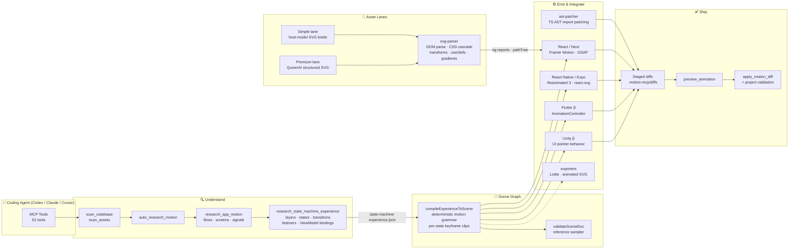
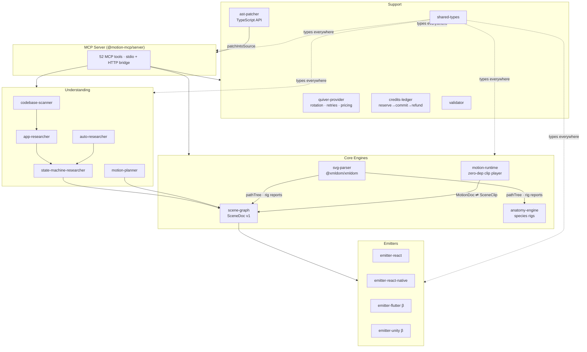

<div align="center">

# ⚡ Motion MCP

**The AI-native motion engine for coding agents — a codebase-aware alternative to Rive's closed pipeline.**

[](./LICENSE)
[](https://github.com/itsoumya-d/motion-mcp/actions/workflows/ci.yml)
[](https://www.typescriptlang.org/)
[](https://modelcontextprotocol.io)
[](#what-it-builds)

</div>

Motion MCP plugs into Codex, Claude Code, Cursor, or any MCP-compatible agent and turns an **existing codebase** into a living, animated product. It scans your app, understands your screens and flows, writes Rive-like state-machine experience specs, compiles them through an open scene format (**SceneDoc**), generates framework-native animation code for React, React Native, Flutter, and Unity, and stages everything as reviewable diffs that apply only after approval.

> **No rewrites. No invented runtime. No generated app replacing the real one.**
> The motion lands inside *your* components, bound to *your* app state, rendered by *your* stack.

---

## What's new — the verification-first milestone (Aug 2026)

Motion MCP closed the loop that separates it from every generate-and-hope tool in this space. 38 → **52 MCP tools**, 154 → **213 tests**, 27 → **29 packages**:

| Capability | What landed |
|---|---|
| **`ensoul_asset` — the whole pipeline in one call** | perceive → generate → verify → repair → preview, over ANY input: raw/indexed SVG, raster PNG, or glTF mesh. Returns a stage-by-stage receipt; nothing commits without review |
| **Live vision judging** | Rendered frames scored 0–100 for "does this read as alive" by **Gemini 2.5 Flash or Claude Sonnet 4.5** (`rubric.judge.provider`), with a deterministic offline mock as the zero-config default |
| **Rubric-as-config** | What "looks alive" means is an editable contract — `.motion-mcp/rubric.json` controls penalties, thresholds, per-check severity, lint tolerances, repair allowlist |
| **Motion-curve linter** | Flags mechanical linear easing on long segments and velocity discontinuities that pop on screen; decaying shakes correctly pass |
| **Iterative auto-repair** | Segment-scoped mechanical fixes (sort/clamp/wrap/easing rewrites) looped against the critic until pass or N attempts — full attempt ledger, never invents amplitudes |
| **Perception engine** | PNG → quantized paint-region parts → rig proposals through the standard auto-rigger; glTF 2.0 skins → exact joint hierarchy with per-joint weight stats; unskinned meshes → inferred band chains |
| **Generation engine** | Deterministic NL intent lexicon (10 verbs × speed/intensity/direction/loop) driving temperament-parameterized procedural synthesis — easing, overshoot, squash-and-stretch and stagger all derive from four personality axes, self-checked before returning |
| **Export-parity gate** | `verify_cross_runtime` bakes a state through both renderable targets (animated SVG + Lottie) and proves every stop time survived — catches exporter drift before it ships |
| **Video-to-rig (`vectorize_video`)** | Cross-frame part tracking over flipbook keyframes (deterministic IoU + centroid matching) infers a SceneDoc bone hierarchy from any moving video — returned as a reviewable `rigProposal`; degenerate tracking stays pure flipbook and reports why |
| **Video-motion smoothing (`motion_to_curves`)** | Tracked part trajectories become eased translateX/Y SceneDoc tracks over persistent per-part layers, plus a standalone animated SVG preview — smooth motion at low keyframe counts instead of flipbook cuts, staged as a reviewable diff with deterministic ids |

Schema evolved without breaking anyone: `temperament`, binding converters (Rive-view-model-style), and per-bone weights are additive SceneDoc v1 extensions under a documented versioning contract ([`docs/scenedoc-v1-extensions.md`](./docs/scenedoc-v1-extensions.md)).

---

## Why not just use Rive?

| | Rive | Motion MCP |
|---|---|---|
| Creation surface | Closed GUI editor | Your coding agent + MCP tools |
| AI role | Operates their desktop editor over local MCP | Is the whole pipeline — headless, codebase-aware |
| Scene format | Proprietary `.riv` binary | **SceneDoc** — open, versioned, diff-friendly JSON |
| Runtime | Their WASM/GPU runtime on every platform | Compiles to each host's native animation system |
| App binding | Designer-guessed inputs (`isLoading`, `progress`…) | Binds to **real** detected app state from your source |
| Code integration | Manual embed of `.riv` files | AST-patched imports staged as reviewable diffs |
| Review workflow | Editor history | Git branches + PRs |

Rive treats AI as an operator of a human-centric editor. Motion MCP deletes the editor: **the repo is the file browser, the chat is the canvas, the diff is the review UI.**

---

## How this differs from Anim8 and Rive MCP

Two other tools define this space. **Anim8** (tryanim8.com) is a manual, browser-based keyframe editor — Figma Motion import in, MP4/animated-SVG out. No AI generation, no state machines, no MCP. **Rive's MCP ecosystem** (official Rive MCP, plus the third-party 139-tool RiveMCP) makes an agent a *tool executor* over Rive's editor: it builds whatever you specify — scenes, state machines, data binding — but RiveMCP states plainly that it "won't draw original illustrations… an animation engineer, not an illustrator."

Motion MCP's wedge is the pieces neither ships:

| Capability | Anim8 | Rive MCP / RiveMCP | Motion MCP |
|---|---|---|---|
| Manual keyframe editing | ✅ primary UX | via Rive editor | override-level only |
| Figma import bridge | ✅ (Figma Motion files) | ❌ | ✅ (`import_figma_scene` — prototype reactions → state machine) |
| Video → vector motion | ❌ | ❌ | ✅ `vectorize_video` — fully local flipbook tracing |
| Auto-rigging from any SVG | ❌ | ❌ (manual rigging) | ✅ `rig_asset` — species schemas, look-at IK, blob fallback |
| App-wide ambient life | ❌ | ❌ (per-file) | ✅ `animate_app_life` — one sweep, every indexed asset |
| Data binding to real app state | ❌ | designer-guessed inputs | ✅ binds to detected source-state properties |
| **Vision-judged self-verification** | ❌ | ❌ (RiveMCP has no verify step; rive-console-mcp lints curves only) | ✅ live Gemini/Claude judge over rendered frames + deterministic mock, rubric-configurable |
| **Closed repair loop** | ❌ | ❌ generate-and-hope | ✅ `auto_repair` / `ensoul_asset` — segment-scoped fixes until pass or N attempts, full attempt ledger |
| **Temperament primitive** | ❌ | ❌ hand-authored per asset | ✅ four personality axes procedurally drive easing/overshoot/squash-stretch/stagger for ANY asset |
| **Perception from PNG & glTF** | ❌ | ❌ | ✅ `perceive_image` paint-region parts · `perceive_3d` exact joint hierarchies with weight stats |
| **Export-parity gate** | ❌ | ❌ | ✅ `verify_cross_runtime` proves stop-level parity across renderable targets before shipping |
| Original asset generation | ❌ | explicitly declined | ✅ simple lane (host model) / premium lane (structured SVG) |
| Agent-controllable surface | ❌ | ✅ tool calls | ✅ 52 tools; agent plans *and* executes the loop |

Honest scope notes for evaluators: video tracing produces layered-flipbook SceneDocs (contour-traced keyframes with temporal reduction), and since the video-to-rig milestone it also tracks parts across those keyframes (IoU + centroid matching) to attach an inferred SceneDoc rig — returned as a reviewable `rigProposal` on `vectorize_video`, with degenerate tracking staying pure flipbook and saying why. This is deterministic contour tracking, not neural pose estimation: occlusion and same-color merges can still confuse part identity. Asset generation produces structured vector SVG — not raster diffusion illustration. And unlike RiveMCP's 267 runtime types, we don't target `.riv` output at all: SceneDoc compiles to native host-framework code, while `import_riv` reads `.riv` in.

**Anim8 is where you animate by hand. Rive MCP builds what you specify. Motion MCP plans, generates, verifies, and ships.**

---

## Architecture



### One spec in, four frameworks out — provably identical

`generate_animation` no longer stamps a fixed template. It loads `state-machine-experience.json`, compiles it into a **SceneDoc artboard**, and every emitter renders *that* — real states, real transitions, real keyframes. A conformance harness pins this contract byte-for-byte across all four targets.

---

## SceneDoc — the open scene format

SceneDoc is motion-mcp's unified interchange format. It merges the two worlds that normally live apart in motion tools: **interactive UI state machines** (Rive-like) and **keyframed character clips** (baked skeletal data).

```jsonc
{
  "formatVersion": 1,
  "sceneId": "scene_landing",
  "artboards": [{
    "artboardId": "page_cta",
    "sourceFile": "app/page.tsx",
    "layers": [
      { "layerId": "layer_main", "targetParts": ["cta-glow", "cta-label"], "initialStateId": "state_idle" }
    ],
    "clips": {
      "clip-state_success": {                       // compiled by the motion grammar
        "durationMs": 620,
        "tracks": [
          { "targetPart": "*", "property": "scale",
            "keys": [{ "t": 0, "value": 1 }, { "t": 240, "value": 1.08, "easing": "easeOut" }, { "t": 620, "value": 1 }] },
          { "targetPart": "*", "property": "rotate",
            "keys": [{ "t": 0, "value": 0 }, { "t": 240, "value": 1.5 }, { "t": 620, "value": 0 }] }
        ]
      }
    },
    "stateMachines": [{
      "initialStateId": "state_idle",
      "states": [{ "stateId": "state_hover", "name": "Hover", "kind": "single", "clipId": "clip-state_hover" }],
      "transitions": [{ "fromStateId": "state_idle", "toStateId": "state_hover", "event": "pointerEnter",
                        "durationMs": 180, "interpolation": "spring" }]
    }],
    "bindings": [{ "property": "isLoading", "targetPart": "cta-label", "source": "app-state" }],
    "semantics": { "reducedMotionSafe": true }
  }]
}
```

### The motion grammar

Semantic states compile deterministically into keyframed clips — same input, same output, every time:

| State semantics | Compiled motion | Duration |
|---|---|---|
| idle / rest / breathe | breathe scale `1 → 1.012 → 1` + opacity swell (looping) | 3400 ms |
| hover | lift `y −2`, scale `1.012` easeOut | 180 ms |
| press / down | depress scale `0.965` | 80 ms |
| success / reward | pop `1 → 1.08 → 1` + rotate wiggle | 620 ms |
| error / warn | shake x `[0, −2, 2, −1, 0]` | 340 ms |
| active / selected | pathLength draw-in + spring scale | 420 ms |
| disabled | hold at opacity `0.48` | hold |

Per-part staggering is baked into keyframe times, so multi-part assets choreograph themselves. A reference sampler (`sampleSceneTrack`) evaluates any track deterministically — it is the ground truth the conformance suite pins against.

---

## Package architecture



| Package | Role |
|---|---|
| `server` | MCP stdio server + HTTP bridge exposing all tools |
| `codebase-scanner` | Framework detection, deps, entry points, component inventory |
| `app-researcher` | Screens, flows, ranked screen motion plans, asset-lane decisions |
| `auto-researcher` | Source-backed research engine: findings → scored opportunities → context packs |
| `state-machine-researcher` | Rive-like per-page experience specs (layers, states, transitions, listeners, bindings) |
| `svg-parser` | Real DOM parsing: style cascade, composed transforms, `<use>`/`<defs>` expansion, gradient registry |
| `scene-graph` | **SceneDoc v1**: compiler, motion grammar, validator, reference sampler |
| `generation-engine` | **Procedural synthesis**: NL intent lexicon + temperament-driven recipes (overshoot, squash-and-stretch, stagger) into self-checked SceneDocs |
| `perception-engine` | **Perception**: PNG → paint-region part segmentation → rig proposals; glTF 2.0 skins/meshes → skeleton proposals with weight stats |
| `anatomy-engine` | Species-aware SVG anatomy (`human-biped`, `avian-crow`) → semantic actions |
| `motion-runtime` | Zero-dependency skeletal FK player: keyframed clips, crossfade layers, hysteresis rep counting |
| `emitter-react` / `-react-native` | Framer Motion variants + transition tables / Reanimated 3 + `react-native-svg` |
| `emitter-flutter` / `-unity` (β) | AnimationController wrappers / UI pointer behavior, DOTween-ready |
| `player` | Zero-dep `ScenePlayer` + `<motion-scene>` web component: transitions, deterministic seek, reduced-motion |
| `exporters` | Lottie JSON writer (bezier paths incl. arc→cubic) · CSS-keyframe animated SVG |
| `riv-importer` | Rive binary reader + structural/keyframe/geometry decoder using rive-runtime's core type keys — paths → SVG, KeyFrameDoubles → SceneClips, SM graphs → topology |
| `figma-bridge` | Figma import bridge: thin plugin collector (frames, elements, prototype reactions) → plain-JSON snapshot → synthesized SceneDoc artboards with per-state pose clips; entry frame renders to layered SVG |
| `vectorizer` | Video → vector animation, fully local: ffmpeg frame extraction, median-cut palette quantization, contour boundary tracing (with hole loops), temporal frame reduction, cross-frame IoU part tracking → playable flipbook SceneDoc with inferred rigs |
| `critic` | Deterministic motion critique: structural checks (key order, value bounds, loop seams, micro-jitter, reduced-motion), headless raster checks (static/blank frames), 0–100 scoring, and safe auto-fixes |
| `capture` | PNG decoder (zlib + all scanline filters) · GIF89a encoder (exact/popularity palette, LZW) · ffmpeg MP4/WebM assembly · resvg frame pipeline |
| `ast-patcher` | Surgical import/usage patches via the TypeScript compiler API |
| `quiver-provider` | Premium SVG generation with key rotation, backoff, live pricing sync |
| `credits-ledger` | Reserve → commit/refund credit integrity with local ledger |
| `validator` | Post-apply typecheck/build validation per framework |

---

## What it builds

| Target | Runtime | Status | Output |
|---|---|---|---|
| React / Next.js | Framer Motion, GSAP-ready | ✅ stable | Animated SVG components + enhancer wrappers, scene-driven variant tables |
| Expo / React Native | Reanimated 3 + react-native-svg | ✅ stable | Pressable shells, shared-value tweens, accessibility-aware |
| Flutter | AnimationController, CustomPainter hooks | 🧪 beta | Enum-driven host-code state machines |
| Unity | UI EventSystem, DOTween-ready | 🧪 beta | Pointer interaction behavior scripts |

Every generated component ships with: reduced-motion handling, semantic labels, controlled/uncontrolled state support, and a host-side state machine you own — nothing phones home at runtime.

## MCP tools (52)

**Understand the codebase**

| Tool | Purpose |
|---|---|
| `scan_codebase` | Framework, deps, entry points, components, animation libs |
| `scan_assets` | Index SVG/Lottie/Rive/images with parsed anatomy trees |
| `get_app_motion_context` | Combined context: screens, flows, tokens, motion thesis |

**Research & plan**

| Tool | Purpose |
|---|---|
| `feed_concept` | Inject brand concept + personality + logo |
| `plan_microinteractions` | Rank micro-interaction opportunities |
| `auto_research_motion` | Source-backed findings → ranked opportunities → context packs |
| `research_app_motion` | Flow-level motion briefs |
| `research_state_machine_experience` | Rive-like page specs before any code is written |
| `plan_screen_motion` | Per-screen moment ranking (brand memory, confidence, delight…) |

**Generate assets**

| Tool | Purpose |
|---|---|
| `estimate_asset_lane` | Simple vs premium lane decision + cost |
| `generate_simple_svg_asset` | Strict SVG brief/checklist for the host model (or direct ingest) |
| `ingest_svg_asset` | Validate + stage any SVG with rig report |
| `generate_premium_svg_asset` | QuiverAI structured SVG generation |
| `generate_svg_asset` / `vectorize_asset` | Direct Quiver calls (image → vector too) |
| `vectorize_video` | **Video → vector animation** (Anim8's headline, fully local): ffmpeg frames → median-cut palette → contour-traced layered SVG keyframes → temporal reduction → playable flipbook SceneDoc |
| `perceive_image` | **Raster perception** (`@motion-mcp/perception-engine`): PNG → quantized connected paint regions → named layered SVG parts → anatomy detection + auto-rigger → commit-free rig proposal. Paint-region segmentation, not ML pose segmentation |
| `perceive_3d` | **glTF 2.0 skeleton proposals**: skinned meshes → exact joint hierarchy + per-joint weight stats from JOINTS_0/WEIGHTS_0; unskinned meshes → inferred band chain along the longest axis. FBX/OBJ/.glb not yet supported |
| `generate_asset_batch` | Up to 64 items, dry-run costing, per-item isolation |
| `analyze_svg_anatomy` / `resolve_anatomy_action` | Species detection; blink/wave/flap/caw resolution |
| `rig_asset` / `list_rig_capabilities` | **Auto-rigger**: bones + eye look-at IK + ambient secondary motion for any SVG (bipeds, birds, quadrupeds, insects, vehicles, universal blob fallback) |
| `list_svg_models` / `estimate_motion_cost` | Live model pricing |

**Animate & ship**

| Tool | Purpose |
|---|---|
| `generate_animation` | SceneDoc-compiled native motion code (options: `style`, `trigger`, `intensity`, `framework`, `patchIntoSource`, `usageAnchor`) |
| `generate_motion_from_prompt` | **Prompt → verified scene**: deterministic lexicon parse (10 action verbs + speed/intensity/direction/loop) → temperament-driven procedural keyframes (easing, overshoot, squash-and-stretch, stagger derive from the axes) → state machine assembly → schema + structural + curve-lint self-check before returning. Stages only |
| `ensoul_asset` | **The closed loop in one call**: perceive (SVG / PNG paint-regions / glTF skeleton) → generate with prompt+temperament → verify → mechanical repair if needed → GIF preview when a raster source exists. Returns a stage-by-stage receipt; everything staged, nothing commits |
| `animate_app_life` | **App-wide ambient-life sweep**: breathe/hover/press (+ blink/wobble/pop by anatomy) across every indexed asset, auto-rigging characters — staged as ONE reviewable diff |
| `bind_motion_to_state` / `list_motion_bindings` | **Data binding**: persisted typed app-state properties drive machine inputs in generated code (`hasError` → error shake, `isLoading` → active emphasis, `isSuccess` → reward pop) |
| `preview_animation` / `apply_motion_diff` | Inspect then apply staged diffs with validation |
| `review_animation` | **Self-verifying quality loop**: deterministic structural critique (key order, value bounds, loop seams, micro-jitter, reduced-motion) + headless render check (static/blank frames), scored 0-100 with actionable fixes — run after `generate_animation`, before `apply_motion_diff` |
| `export_animation` | Bake a SceneDoc state into **Lottie JSON** or self-contained **animated SVG** |
| `lint_motion_curves` / `auto_repair` / `judge_against_reference` | **Verification-loop surface** (see below): curve linting, closed repair loop, vision-judge scoring |
| `verify_cross_runtime` | **Export-parity check**: bakes one state through both renderable targets and verifies every stop time survived per property bucket — catches exporter drift before shipping |
| `apply_temperament` | **Ensoulment primitive**: preset/axis personality → deterministic timing + easing rewrite (see below) |
| `render_preview` / `export_asset` | Standalone GIF preview; destination-aware export with format fallback (see below) |
| `propose_rig` / `motion_docs_search` | Commit-free rig proposals; docs-MCP grounding over the schema + extension contracts |
| `import_riv` | **Migration engine**: validate any `.riv`, then decode it — artboards, animations, state-machine topology, **path geometry with ARGB fills**, and **keyframed transform tracks** — into renderable SceneDocs. Imported files play immediately via `<motion-scene>` or `capture_gif` |
| `capture_gif` | Render a SceneDoc state to an animated **GIF** — no browser: headless SVG rasterization + pure-TS GIF89a/LZW encoder |
| `capture_video` | Same pipeline into **MP4 (H.264)** or **WebM (VP9)** via system ffmpeg |
| `preview_animation` | Now returns real `snapshotImageBase64` previews of staged diffs (headless render) |
| `curate_workout` | Deterministic workout composition for the exercise stack |
| `get_credit_balance` / `purchase_credits_url` | Credit ops |

Every generated/ingested SVG carries a **rig report**: which roles (`eyes`, `head/body`, `mouth/beak`, `limb/wing`, `tail`, `shadow`, `sparkle`) were detected, what they can bind to (eye-follow, blink, press-depress…), and what's missing — verify state-machine readiness before generating code.

**Characterize anything with `rig_asset`**: the auto-rigger turns any indexed SVG (or raw source) into a SceneDoc v1 rig block — bones from detected anatomy, an eye **look-at IK chain**, and ambient **secondary motion** (`breathe` 3400 ms, `blink` 4200 ms, tail spring, wing sway). Species schemas cover `human-biped`, `avian-crow`, `generic-quadruped`, `insect`, `vehicle` (chassis/cab/headlights/wheels), and a universal `blob` fallback — so *every* file, even one with no recognizable anatomy, ships alive by default.

**Bring the whole app to life with `animate_app_life`**: one call gives every indexed SVG asset an ambient state machine (idle breathe → hover lift → press squash, plus blink/wobble/reward-pop when anatomy supports it), auto-rigging characters along the way — staged as a single reviewable diff. Then `bind_motion_to_state` wires generated components to real app state: bound properties become a typed `data` prop that drives machine inputs (`hasError → error shake`, `isLoading → active emphasis`, `isSuccess → reward pop`).

**Close the loop with `review_animation`**: every generated scene can be self-verified before it ships — structural checks catch unsorted keys, out-of-range values, loop-seam pops, and micro-jitter; headless render checks catch static output (tracks targeting missing part ids) and blank frames. Reports score 0-100, persist under `.motion-mcp/critiques/`, and return deterministic fixes the host agent can apply. Works immediately after ingestion via the ambient-scene fallback — no research step required.

### The verification rubric — what "looks alive" means, as config

The critic's scoring contract lives in an **editable rubric file**, not hardcoded constants. Ship defaults replicate historical behavior; a project overrides anything via `.motion-mcp/rubric.json` (deep-merged over defaults):

```jsonc
{
  "version": 1,
  "scoring": { "failPenalty": 25, "warnPenalty": 8, "passThreshold": 100 },
  "checks": { "easing-mechanical": { "severity": "fail" }, "micro-jitter": { "enabled": false } },
  "curveLint": { "linearEasingMinSpanMs": 120, "velocityJumpRatio": 6 },
  "judge":   { "provider": "mock", "alivenessThreshold": 55 },
  "repair":  { "maxAttempts": 3, "allowedFixes": ["sort-keys", "clamp-bounds", "loop-wrap", "rewrite-linear-easing"] }
}
```

New verification tools on top of `review_animation`:

| Tool | Purpose |
|---|---|
| `lint_motion_curves` | Pure-math curve lint: mechanical linear easing on long segments, velocity discontinuities that pop |
| `auto_repair` | The closed loop: critique → segment-scoped mechanical fixes → re-critique, up to N attempts, full ledger |
| `judge_against_reference` | Vision-judge pass over headless-rendered frames, scored against the rubric threshold. **Live providers shipped**: `rubric.judge.provider: "gemini"` (Gemini 2.5 Flash via `GEMINI_API_KEY`) or `"claude"` (Claude Sonnet 4.5 via `ANTHROPIC_API_KEY`) — the deterministic mock stays the zero-config default |
| `motion_docs_search` | docs-MCP grounding over SceneDoc schema + extension contracts so agents stop hallucinating properties |
| `propose_rig` | Rig **proposal** without persistence — review, then commit via `rig_asset` |

Run the loop standalone from the CLI:

```bash
pnpm critic examples/verify-loop/broken-scene.json          # exits non-zero if unrepairable
```

### Temperament — personality as a primitive

`apply_temperament` resolves a named preset (`calm`, `energetic`, `nervous`, `playful`, `precise`, `heavy`) or explicit `energy / weight / warmth / precision` axes in [0,1] into a deterministic motion profile — duration scaling, easing substitution, overshoot/squash/stretch budgets, secondary-motion amplitude — and rewrites any component's compiled scene to match. Timing and easing only; amplitudes are never invented. Staged output lands in `.motion-mcp/scenes/` for review before use.

### Delivery: destination-aware export

`export_asset` bakes a compiled state to animated SVG, Lottie JSON, GIF, MP4, or WebM — choosing automatically from the stated `destination` (`web → animated-svg`, `flutter/ios/android → lottie→gif fallback`, `unity/video → gif/webm/mp4`) with a recorded fallback trail when a format can't render. `render_preview` produces a base64 GIF of any state with no staged diff required.

Schema extensions (temperament block, binding converters à la Rive view models, per-bone weights) are additive under SceneDoc v1 — see [`docs/scenedoc-v1-extensions.md`](./docs/scenedoc-v1-extensions.md) for the versioning contract.

### The closed loop, end to end

The master pipeline is now wired as one tool:

```text
any asset ──▶ ensoul_asset ──▶ [perceive] ──▶ [generate] ──▶ [verify] ──▶ [repair] ──▶ [preview]
   svg ──────────────▶ named parts + anatomy
   png ──────────────▶ paint-region parts + rig proposal
   gltf ─────────────▶ joint hierarchy / inferred band chain
                                        │
        prompt + temperament drive easing, overshoot,
        squash-stretch, stagger, durations
                                        │
                    self-check gates nextTool routing:
        ok → review_animation   ·   broken → auto_repair
```

Each stage also stands alone as its own tool, so agents can compose or override any step — `ensoul_asset` is the default happy path, not a black box.

---

## Quality gates: conformance, goldens, determinism

```bash
pnpm test          # node --test — 213 tests across 42 suites
pnpm typecheck     # strict TS across all 29 packages
pnpm build         # topological build
```

Highlights:

- **Conformance harness** — one canonical SceneDoc fixture drives all four emitters. Asserts every scene state appears in each target's output, transition edges survive compilation, and legacy mode stays byte-stable.
- **Golden frames without a browser** — pinned numeric samples from the reference evaluator (e.g. success-pop scale at `t=120ms ⇒ 1.06 ± 1e-9`) define the timing truth every future renderer must honor.
- **Byte-deterministic generation** — identical inputs produce identical files modulo timestamps.
- **Real parser tests** — multi-line attributes, comments, entities, transform composition, CSS specificity, `<use>` cycles, malformed-input resilience.

---

## Asset lanes, QuiverAI, credits

Two lanes, one pipeline:

- **Simple lane** — the host coding model generates SVG from a strict brief + acceptance checklist; `ingest_svg_asset` validates and indexes it. Zero marginal cost.
- **Premium lane** — QuiverAI structured SVG when complexity or brand importance justifies credits. Keys stay server-side.

Resilience built in:

- `QUIVERAI_API_KEYS` round-robins comma-separated keys, rotating away on `401/402/429`
- Exponential-backoff retries on `429`/`5xx`, honoring `x-ratelimit-reset`
- Fallback pricing matches live Quiver rates (`arrow-1.1` = 20 cr, `arrow-1.1-max` = 25 cr)
- Batch mode isolates failures — one bad item never aborts 64
- Credits reserve `ceil(quiver_price × 2)`, commit only after a usable SVG stages

Production billing defaults: Free 100 cr/mo · Pro $20/mo 2,000 cr · Team $50/seat 5,000 cr · Topup $10/1,000 cr.

---

## 3D Exercise Stack

Beyond UI motion, the same engines drive a full exercise system:

- [`anatomy-engine`](./packages/anatomy-engine) — species schemas turn plain SVGs into rigged characters: a crow "waves" with wing lift + head bob; a human waves with arms
- [`motion-runtime`](./packages/motion-runtime) — zero-dep humanoid skeleton player: squat/jumping-jack/curl/lunge clips, base+overlay crossfading, hysteresis rep counting
- [`apps/exercise-demo`](./apps/exercise-demo) — web studio: procedural character, cheer/form overlays, optional BlazePose camera rep counting, SVG mascots reacting to the same event stream
- [`apps/exercise-mobile`](./apps/exercise-mobile) — Expo shell running the *identical* runtime via pure-TS FK projected into `react-native-svg`
- [`pipeline/`](./pipeline) — Python offline baking: MotionDoc interchange, RDP reduction + quantization, retarget solver, ARDY adapter. Baked JSON plays directly via `sceneClipFromMotionDoc`

```bash
pnpm --filter @motion-mcp/exercise-demo dev   # http://localhost:5175
```

---

## Getting started

```bash
pnpm install
pnpm build
pnpm dev:mcp          # stdio MCP server
```

Wire it into your agent — e.g. Claude Code:

```bash
claude mcp add motion-mcp -- node /absolute/path/to/motion-mcp/packages/mcp-server/dist/index.js
```

Or add to `.mcp.json` (this repo ships one — it doubles as a local Codex plugin via `.codex-plugin/plugin.json`):

```json
{ "mcpServers": { "motion-mcp": { "command": "node", "args": ["packages/mcp-server/dist/index.js"] } } }
```

Local dev notes: credits ledger lives in `.motion-mcp/credits.json` with a default grant; Quiver runs in deterministic mock mode unless keys are set (`MOTION_MCP_QUIVER_MOCK=1` forces mock).

### Example agent session

```text
scan_codebase({ rootPath: "." })
scan_assets({ rootPath: "." })
feed_concept({ brandConcept: "…", brandPersonality: ["precise","alive","playful"], logoSvgPath: "public/logo.svg" })
auto_research_motion({ brief: "highest-leverage motion improvements" })
research_state_machine_experience({ brief: "Rive-like page specs first" })

estimate_asset_lane({ screenId, assetBrief: "premium animated logo mark" })
generate_premium_svg_asset({ assetBrief: "…", placement: { screenId, moment: "first brand impression" } })

generate_animation({
  componentId,
  options: { intensity: "expressive", patchIntoSource: true, usageAnchor: "<Button>Buy</Button>" }
})
preview_animation({ diffId })     // inspect the staged diff
apply_motion_diff({ diffId })     // writes files + runs project validation
```

### Repository layout

```text
motion-mcp/
├── packages/               # 27 workspace packages (see architecture above)
├── apps/
│   ├── exercise-demo/      # Web studio demo
│   ├── exercise-mobile/    # Expo shell
│   └── web/                # Landing page
├── examples/next-app       # Reference integration with real .motion-mcp artifacts
├── pipeline/               # Offline Python bake pipeline (ARDY-ready)
├── skills/motion-mcp/      # Canonical 13-step agent workflow
└── tests/                  # 34 suites incl. conformance harness
```

---

## Roadmap

**Shipped — Phase A foundations**

- ✅ `svg-parser`: DOM-based parsing replaces regex scanners everywhere
- ✅ `scene-graph`: SceneDoc v1 + deterministic motion grammar + validation + reference sampler
- ✅ Spec-to-code disconnect closed: experiences compile through SceneDoc into all four emitters
- ✅ `ast-patcher`: generated imports staged into real source files behind flags
- ✅ Conformance harness with cross-target goldens

**Phase B: portability (in motion)**

- ✅ `@motion-mcp/player`: `ScenePlayer` (transition graph, loop-aware seek, reduced-motion) + `<motion-scene>` web component
- ✅ `@motion-mcp/exporters`: Lottie JSON (full path→bezier incl. arcs) · animated SVG with baked keyframes
- ✅ `export_animation` MCP tool writing `.motion-mcp/exports/`

- ✅ `@motion-mcp/riv-importer`: binary reader per the public `.riv` spec (header, ToC backing-type bits, object stream) + `import_riv` tool
- ✅ `@motion-mcp/capture`: animated GIF output via headless rasterization — pure-TS LZW/GIF89a, zero browser dependency

- ✅ MP4/WebM assembly on the frame pipeline (`capture_video`, ffmpeg)
- ✅ Real visual previews: `preview_animation` returns rendered snapshots of staged diffs

- ✅ Keyframe + geometry decode from `.riv`: imported files render and animate through the player/GIF pipeline out of the box

Remaining:

1. Import fidelity extensions: parametric shapes (rect/ellipse), cubic mirrored/asymmetric vertices, gradient paints, strokes
2. Hosted share links for exported artifacts

**Then — Phase C/D: ecosystem**

5. Dynamic context engine (live re-index on file change)
6. Critique agent + motion-grammar dataset from accept/reject/edit telemetry
7. Stripe + Supabase billing mirror · hosted preview links · CI
8. Pixel-level visual cross-runtime diffing (headless Lottie renderer; stop-parity already enforced by `verify_cross_runtime`)
9. Pose-tracked rigging from video (BlazePose → bone hierarchy)

---

## License

[Apache-2.0](./LICENSE) © motion-mcp contributors
