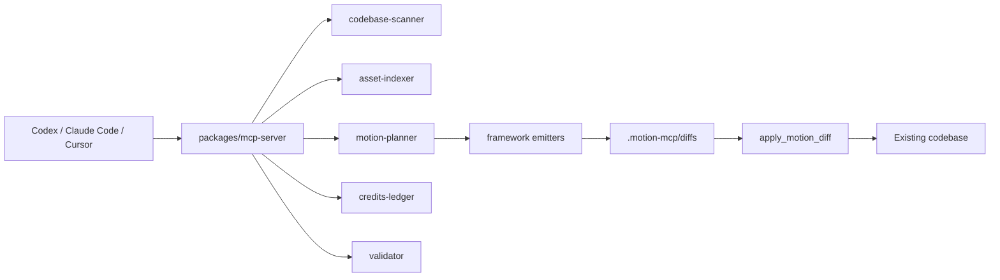

# Architecture

## Design Decisions

- Local-first scanning protects source privacy and keeps the MCP useful without cloud setup.
- Credits are abstracted behind `credits-ledger`; the MVP uses local JSON, later versions can use Supabase + Stripe.
- Generated motion is staged as diff JSON before file writes.
- Emitters generate framework-native code and avoid inventing a player/runtime.
- React/Next is the deepest MVP path; React Native, Flutter, and Unity are present as real extension seams.

## Data Files

- `.motion-mcp/scan.json`: normalized codebase scan.
- `.motion-mcp/assets.json`: normalized asset inventory.
- `.motion-mcp/concept.json`: saved brand/app concept.
- `.motion-mcp/plan.json`: ranked motion plan.
- `.motion-mcp/diffs/*.json`: staged generated diffs.
- `.motion-mcp/credits.json`: local credit ledger.
